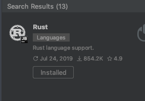
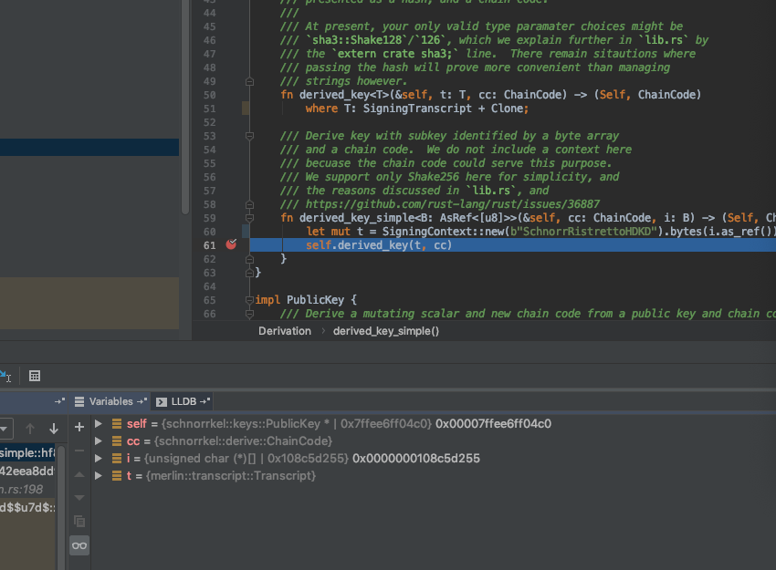
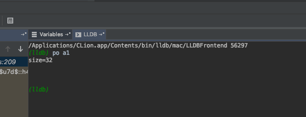

## 安装Rust
Polkadot编译需要安装Rust  
点击链接安装Rust  
https://www.rust-lang.org/tools/install

## 下载Polkadot源码
克隆代码

    git clone https://github.com/paritytech/polkadot.git    
使用官方教程编译  
https://github.com/paritytech/polkadot/  
下载Rust第三方库可能很慢 使用国内镜像可能会失败

## 动态运行
在polkadot 执行下面命令可以直接运行无需编译

    cargo run --release

如果是Local运行过程中没有加入--dev命令不会自动挖矿  
cargo 需要加入 -- 才是传参数给运用

    cargo run --release -- --dev -d /tmp/testnet0 --ws-port 9944 --rpc-port 9933

## 断点调试
需要使用CLion 经过测试Win可与运行但没法进行调试 Mac可以进行断点 主要是需要LLVM  

在CLion中搜索Rust插件  如果安装过Rust cargo就无需再配置

  

之后在Mac中就可以进行断点调试

LLDB命令和XCode一致  

