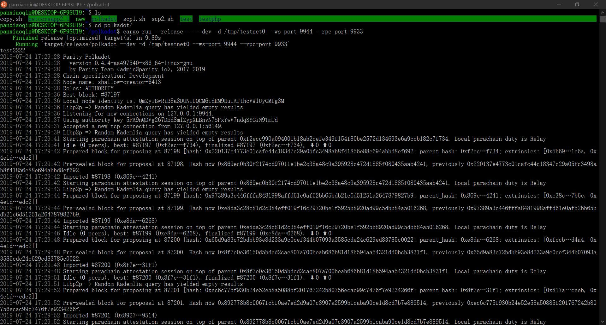
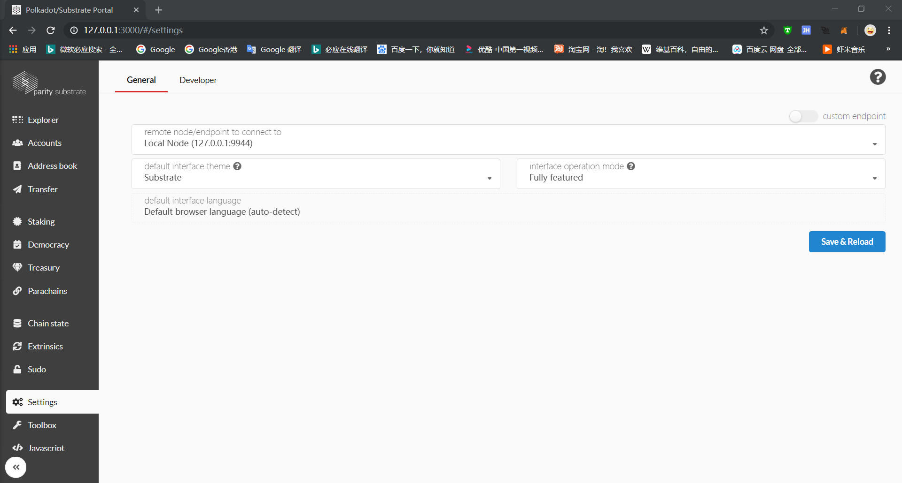

## 环境配置
安装NodeJS  
安装Yarn

## 下载源码
    git clone https://github.com/polkadot-js/apps.git

首先运行 "yarn" 下载第三方库 下载很慢  
之后运行下面命令 

    yarn start

打开 http://127.0.0.1:3000/ 就是钱包

## 配置
运行Polkadot钱包

  

设置链接节点

  

## 简单介绍

Explorer 主要可以查看挖矿情况和新块  
Accounts 可以创建账号和发送交易  
Toolbox 可以调用RPC 默认的author.submitExtrinsic可以广播交易